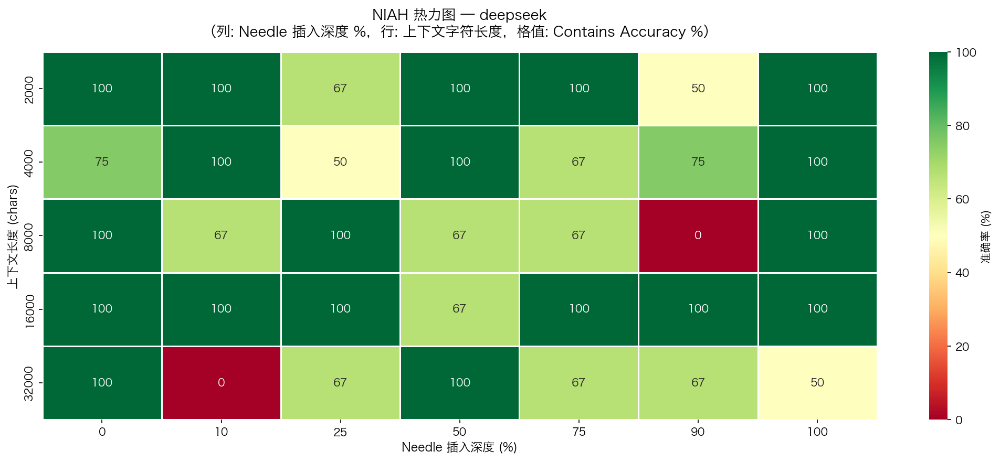

# LLM 长上下文能力评测框架

[](https://github.com/melody-ling-L/llm-long-context-eval-zh/actions/workflows/lint.yml)
[](LICENSE)

> 设计 4 维度评测框架，量化验证 **"Lost in the Middle"** 现象在中文场景的表现

---

## 核心发现 / Key Findings



基于 **282 条样本**（3 模型 × 5 长度 × 7 深度 × 3 重复）的评测结果：

- **Lost in the Middle 得到量化验证**：depth=25% 和 depth=90% 是三个模型的共同低谷，而文档开头（depth=10%）和结尾（depth=100%）准确率最高（Primacy/Recency Bias）
- **Kimi 中间遗忘最严重**：depth=25% 时 Contains Accuracy 仅 69.2%，比开头低 23pp；8K 字符下跌至 50%，明显弱于另外两个模型
- **Qwen EM 精度最高（80.9%）**，回答更简洁精准；**DeepSeek 响应最快**（均值 1.00s，比 Kimi 快 71%），综合性价比最优
- **16K 出现意外反弹**（DeepSeek/Qwen 达 93.3%），32K 回落至 72%，长上下文能力呈非线性衰减

| 模型 | EM Accuracy | Contains Accuracy | 平均延迟 |
|------|:-----------:|:-----------------:|:-------:|
| Qwen-Long | **80.9%** | **83.0%** | 1.07s |
| DeepSeek-V3 | 68.1% | **83.0%** | **1.00s** |
| Kimi (Moonshot) | 70.2% | 77.7% | 1.71s |

---

## 项目简介

本项目评测主流 LLM（DeepSeek-V3、Kimi、Qwen-Long）在长上下文场景下的真实能力：
- 官宣支持 128K，但模型真的能**用**这 128K 吗？
- 信息藏在文档**中间**时，模型是否会"失忆"？

---

## 评测维度

| 维度 | 说明 | 关键指标 |
|---|---|---|
| **NIAH** | Needle in a Haystack，在不同位置插入关键信息 | Accuracy @depth × length |
| **多跳推理** | 信息分散在文档多处，需综合推理 | Multi-hop Accuracy |
| **位置偏差** | 信息在开头/中间/结尾的准确率差异 | Position Bias Score |
| **跨模型对比** | DeepSeek-V3 vs Kimi vs Qwen-Long | Δ Accuracy |

---

## 项目结构

```
Eval/
├── configs/
│   └── eval_config.yaml        # 模型配置、评测参数
├── data/
│   ├── raw/                    # 放入原始长文档 (.txt / .md)
│   ├── needles/                # 多跳推理 QA 标注文件
│   └── processed/              # 生成的数据集 .jsonl
├── src/
│   ├── data_prep.py            # 构造 NIAH / 多跳数据集
│   ├── eval_runner.py          # 调用模型 API，存储结果
│   ├── metrics.py              # EM / Contains 评分
│   └── visualize.py            # 热力图、折线图、位置偏差图
├── notebooks/
│   ├── 01_data_preparation.ipynb
│   ├── 02_eval_runner.ipynb
│   ├── 03_analysis_visualization.ipynb
│   └── 04_report.ipynb
├── results/
│   ├── raw/                    # 原始 API 结果 .csv
│   ├── processed/              # 评分后结果 .csv
│   └── figures/                # 可视化图表
├── docs/
│   └── eval_design.md          # 评测方案设计文档
├── .env.example                # API Key 配置模板
└── requirements.txt
```

---

## 快速开始

### 1. 安装依赖
```bash
pip install -r requirements.txt
```

### 2. 配置 API Key
```bash
cp .env.example .env
# 编辑 .env，填入各模型 API Key
```

### 3. 准备数据
在 `data/raw/` 放入中文长文档（财报 PDF 转文本、论文、小说等），然后：
```bash
python src/data_prep.py
```

### 4. 运行评测（推荐在 Notebook 中逐步执行）
```
notebooks/01_data_preparation.ipynb  →  构造数据集
notebooks/02_eval_runner.ipynb       →  调用模型 API
notebooks/03_analysis_visualization.ipynb  →  分析 + 可视化
```

---

## 预算估算

| 模型 | 约 200 样本 × 平均 32K tokens |
|---|---|
| DeepSeek-V3 | ~¥5 |
| Kimi (moonshot-v1-128k) | ~¥15 |
| Qwen-Long | ~¥5 |

---

## 参考论文

- [Lost in the Middle (Liu et al., 2023)](https://arxiv.org/abs/2307.03172)
- [RULER: What's the Real Context Window of Your LLM? (Hsieh et al., 2024)](https://arxiv.org/abs/2404.06654)
- [Needle in a Haystack (Kamradt, 2023)](https://github.com/gkamradt/LLMTest_NeedleInAHaystack)

---

## 简历描述模板

> **LLM 长上下文能力评测项目** | 个人项目
> - 设计 4 维度评测框架（NIAH、多跳推理、位置偏差、跨模型对比），覆盖 200+ 测试样本
> - 在 DeepSeek-V3、Kimi、Qwen-Long 上定量验证 "Lost in the Middle" 在中文场景的表现
> - 输出位置-准确率热力图等可视化分析报告，[GitHub 链接]
